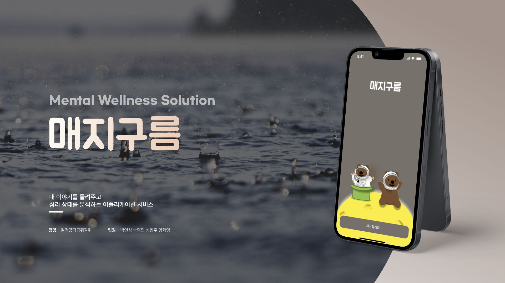

# 매지구름 🌥️
## 찰떡콩떡 해커톤 [찰떡콩떡콩쥐팥쥐 팀] 🍡🐰

2022년 12월에 인천대학교 멋쟁이사자처럼 주관 찰떡콩떡 해커톤의 프로젝트 주제로 매지구름 프로젝트를 진행하였습니다. 사람들의 감정을 분석하고 이에 대한 피드백을 사용자에게 제공하는 서비스입니다.

매일매일 일기를 작성하면 작성된 일기를 인공지능 모델을 통해서 분석합니다. 분석된 내용을 Softmax 단을 통해 **Normal, Anger, Anxious, Stressed** 로 분류합니다. 최종적으로는 4개의 분류 값을 더하면 1이 되는 Normalization 이 된 값으로 반환됩니다. 

저는 해당 프로젝트에서 인공지능 모델 개발을 담당 하였고 모델은 CNN + GRU로 진행하였습니다.

